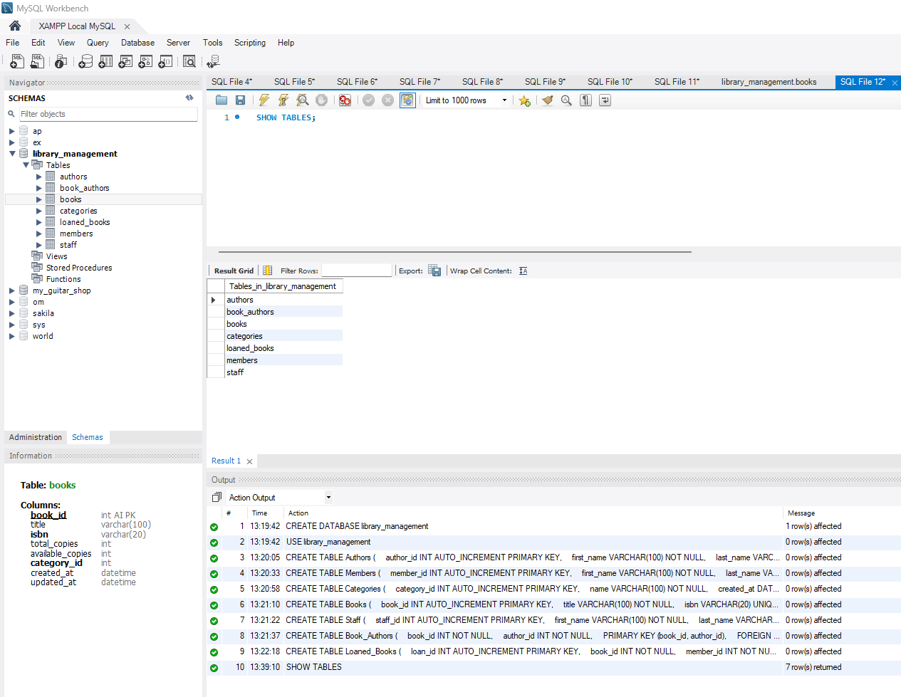
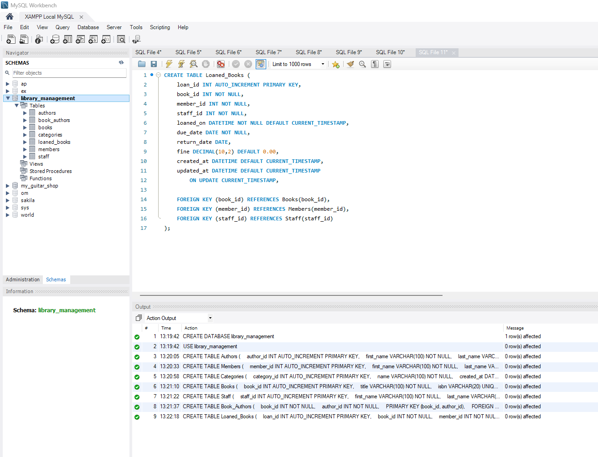
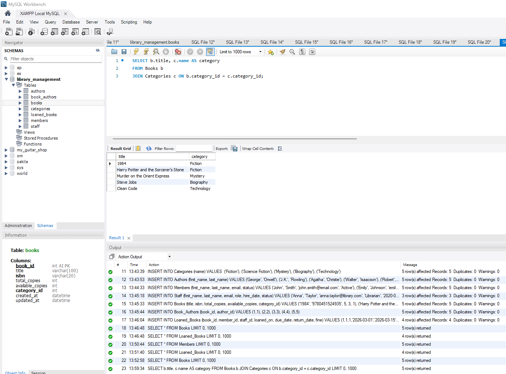
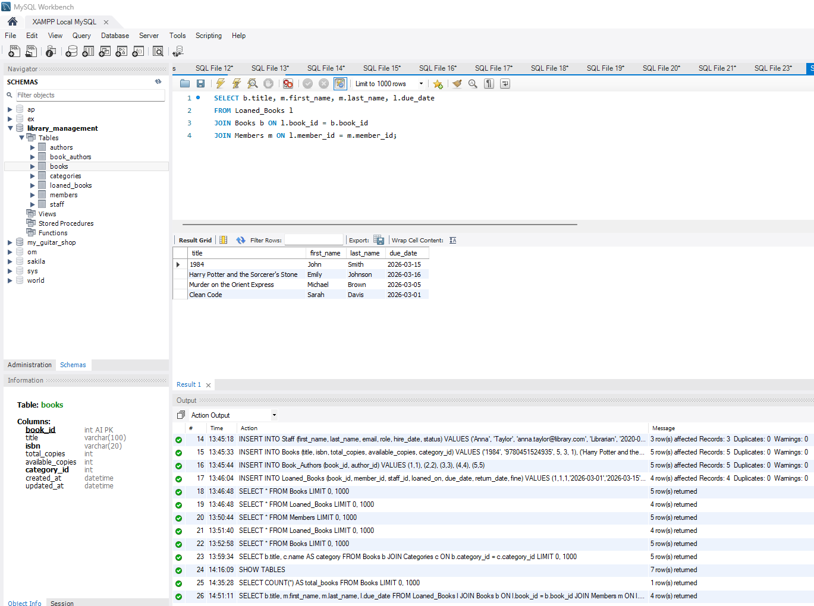

# Library Management System

A relational database project built with MySQL and MySQL Workbench to organize and manage library data, including books, authors, members, staff, categories, and lending records.

## Project Overview

This project demonstrates the design and implementation of a relational library management database. The database stores information across multiple related tables and uses primary keys, foreign keys, and SQL queries to connect and retrieve data.

The system includes seven tables:

- `authors` – stores author information
- `books` – stores book titles, ISBNs, copy counts, and category information
- `categories` – organizes books by category
- `members` – stores library member information and account status
- `staff` – stores library staff information
- `book_authors` – connects books with their authors
- `loaned_books` – tracks borrowed books, members, staff, due dates, return dates, and fines

## Technologies Used

- MySQL
- MySQL Workbench
- SQL

## Database Concepts Demonstrated

- Relational database design
- Primary and foreign keys
- One-to-many relationships
- Many-to-many relationships
- Table creation and data insertion
- Data types and constraints
- `SELECT` queries
- `JOIN` operations
- Aggregate functions such as `COUNT()`
- Filtering and retrieving related data

## Example Queries

The project includes queries that retrieve and combine information stored across the database.

### Books and Categories

```sql
SELECT b.title, c.name AS category
FROM Books b
JOIN Categories c ON b.category_id = c.category_id;
```

This query connects the `books` and `categories` tables to display each book with its corresponding category.

### Loan Records

```sql
SELECT b.title, m.first_name, m.last_name, l.due_date
FROM Loaned_Books l
JOIN Books b ON l.book_id = b.book_id
JOIN Members m ON l.member_id = m.member_id;
```

This query combines lending, book, and member data to display borrowed books with the associated member and due date.

## Project Screenshots

### Database Tables



### Database Schema Creation



### Book and Category JOIN Query



### Loan Records JOIN Query



## Running the Project

1. Open MySQL Workbench and connect to a MySQL server.
2. Open `library_database_setup.sql`.
3. Execute the SQL script to create the database and its tables.
4. Run the included queries to explore the stored library data and table relationships.
